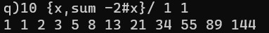
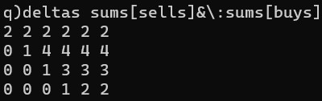

# KDB-Q


Kdb+ is a powerful database that can be used for streaming, real-time and historical data. Q is the SQL-like, general-purpose programming language built on top of kdb+. It offers high-performance, in-database analytic capabilities.

This project provides a glimpse into the available tools to work with CSV files and describes how kdb+ and its query language q raise CSV processing to a new level of performance and simplicity.


Fibonacci using q is a single liner

```
10 {x,sum -2#x}/ 1 1
```



---


Example: FIFO Allocation

```
q)buys:2 1 4 3 5 4f
q)sell:12f
q)sums buys
2 3 7 10 15 19f
q)sell&sums buys
2 3 7 10 12 12f
q)deltas sell&sums buys
2 1 4 3 2 0f
q)sells:2 4 3 2
q)sums[sells] &\: sums[buys]
2 2 2 2  2  2
2 3 6 6  6  6
2 3 7 9  9  9
2 3 7 10 11 11
q)deltas sums[sells]&\:sums[buys]
2 2 2 2 2 2
0 1 4 4 4 4
0 0 1 3 3 3
0 0 0 1 2 2

```




